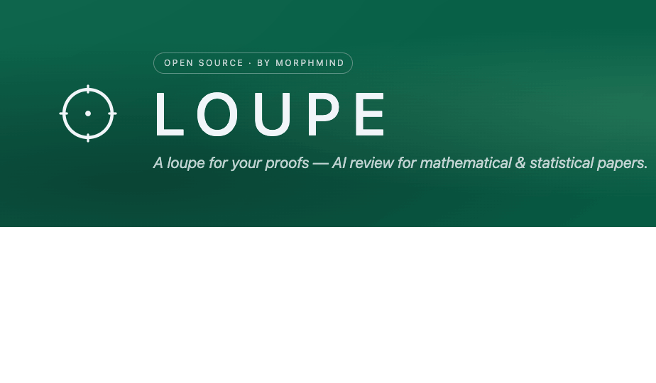
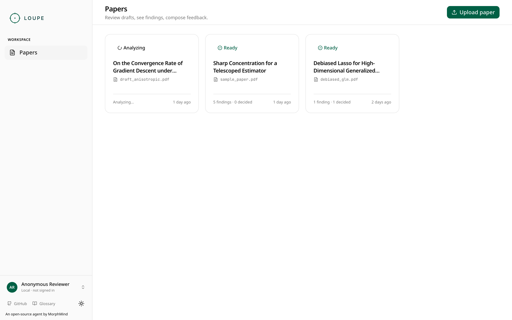
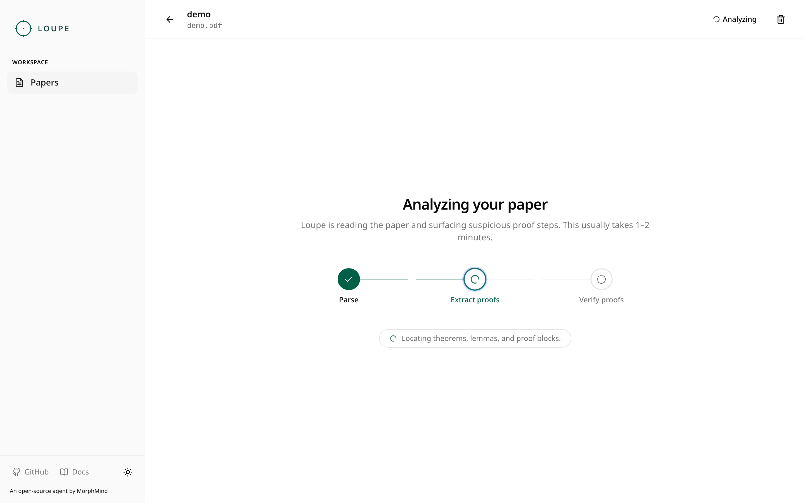
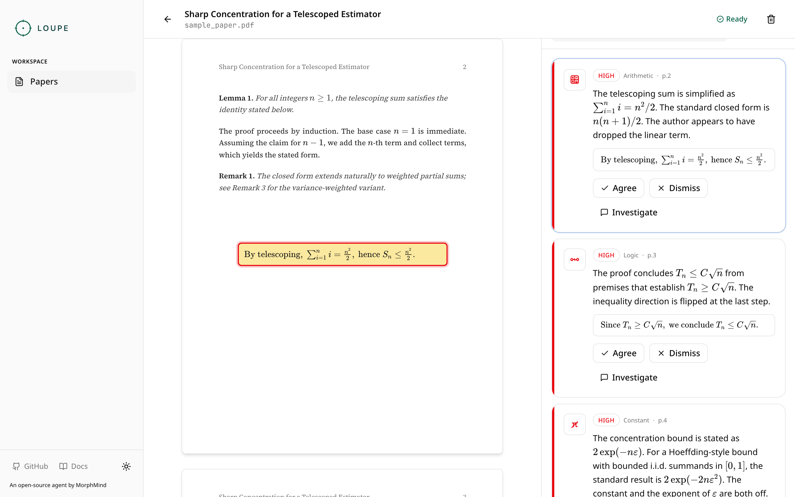
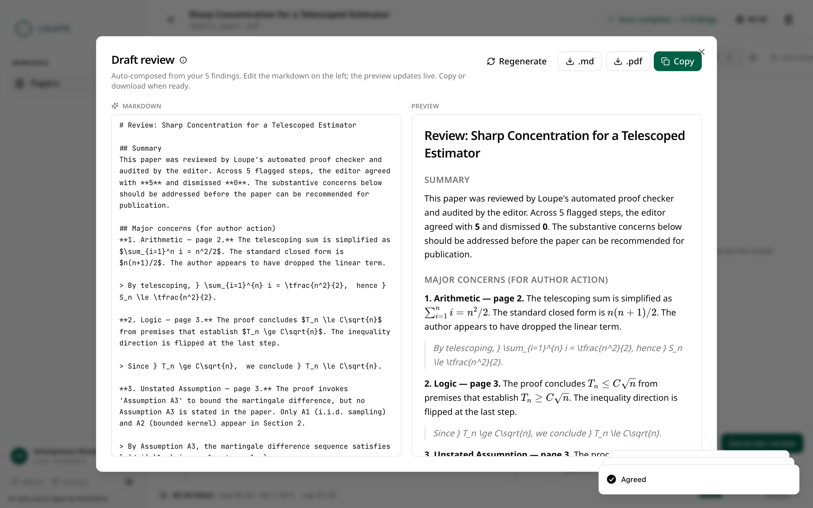

<p align="center">
  
</p>

<h1 align="center">Loupe</h1>

<p align="center">
  <strong>A loupe for your proofs.</strong><br>
  An open-source AI proof reviewer for mathematical and statistical papers.
</p>

<p align="center">
  <a href="#quick-start"></a>
  <a href="./LICENSE"></a>
  <a href="https://loupe.morphmind.ai"></a>
  <a href="#"></a>
</p>

<p align="center">
  <a href="#what-loupe-does">What it does</a> ·
  <a href="#quick-start">Quick start</a> ·
  <a href="#architecture">Architecture</a> ·
  <a href="#contributing">Contributing</a>
</p>

---

## What Loupe does

Loupe is an AI review tool for statistics and CS-theory journal editors. Upload a paper; in 1–2 minutes, Loupe surfaces the handful of proof steps that deserve a second look — arithmetic slips, flipped inequalities, unstated assumptions, wrong constants, quantifier confusion — then lets you agree, dismiss, or push back on each one before generating a draft review you can edit and send.

It's the opinionated take of a journal reviewer's first pass, compressed from two hours into twenty minutes.

**Loupe is not** a proof solver, a plagiarism checker, or a replacement for human judgment. It's a magnifier — you decide what matters.

## Key features

- **3-step agentic pipeline** — parse (MinerU) → extract proofs → verify proofs. Straightforward and auditable. Each step's output is inspectable.
- **Visual localization** — every finding gets pinned to a bounding box on the PDF, verified by a vision pass. Parser-mismatched findings are silently dropped (no false bboxes).
- **Issue types grounded in the domain** — arithmetic, logic, unstated assumption, wrong constant, quantifier scope, citation required, definition mismatch, missing step.
- **Investigate, don't trust blindly** — any finding can be opened into a back-and-forth thread. Quick actions: re-derive, find a counterexample, check the citation, propose a fix.
- **Severity + confidence on every finding** — triage in seconds; sort by severity, page, or confidence.
- **Draft review generator** — produces a structured markdown review grouped by your verdicts. Edit in a live split-preview, copy or download as `.md` or `.pdf`.
- **Local-first, OSS** — run it on your laptop. Your papers never leave your machine unless you want them to. Bring your own LLM key.

## Screenshots

| | |
| :--- | :--- |
|  |  |
| *Home — review drafts, see findings, compose feedback.* | *Watch the 3-step pipeline run live.* |
|  |  |
| *PDF + findings panel with bbox overlays.* | *Auto-composed review, editable live.* |

> Screenshots pending — take them on your first successful run and drop into `docs/screenshots/`.

## Quick start

### Run the frontend alone (mock mode — no backend needed)

```bash
cd frontend
npm install
npm run dev
```

Open <http://localhost:3009>. The frontend ships with a hand-crafted 5-bug fixture; you can walk the full upload → analyze → review flow without any backend. Toggle off later by setting `NEXT_PUBLIC_USE_MOCK=0` in `frontend/.env.local`.

### Run backend + frontend locally

```bash
# one terminal
cd backend
python -m venv .venv
source .venv/bin/activate
pip install -r requirements.txt
uvicorn app.main:app --reload --port 8010

# another terminal
cd frontend
npm install
npm run dev
```

Frontend runs on `:3009`, backend on `:8010`. Frontend proxies `/api/*` to the backend (see `frontend/next.config.mjs`).

### Configure providers

Copy `.env.example` → `.env` in the repo root and fill in at least one:

```bash
# Default provider for parse + extract + verify
ANTHROPIC_API_KEY=sk-ant-...

# Optional overrides; see backend/app/config.py for all options
DEFAULT_MODEL=claude-sonnet-4-6
VISION_MODEL=claude-opus-4-7
```

Supported providers: Anthropic (Sonnet / Opus), OpenAI (GPT-4.1), DeepSeek V3, Moonshot (Kimi K2.5), MiniMax M2.7. Visual localization requires an Anthropic vision-capable model.

## Architecture

```
                 ┌──────────────────────┐
                 │  Next.js 14 frontend │
                 │   /papers · workspace │
                 └──────────┬───────────┘
                       /api │  mock-able via MSW
                            ▼
                 ┌──────────────────────┐
                 │    FastAPI backend    │
                 │   JSON-file storage   │
                 └──────────┬───────────┘
        ┌───────────────────┼──────────────────────┐
        ▼                   ▼                      ▼
 ┌─────────────┐   ┌──────────────────┐   ┌──────────────────┐
 │   MinerU    │   │  LLM providers   │   │  Vision model    │
 │  (parse →   │   │  (extract, verify,│   │ (localize bbox + │
 │  markdown)  │   │   investigate)   │   │  verify evidence)│
 └─────────────┘   └──────────────────┘   └──────────────────┘
```

Everything is **raw HTTP** — no SDK dependencies for LLM providers, easy to fork and swap. Storage is flat JSON files in `data/` for clone-and-inspect friendliness.

## Project structure

```
loupe/
├── backend/
│   └── app/
│       ├── main.py              # FastAPI app, singletons
│       ├── models.py            # Pydantic shapes (mirror frontend/lib/types.ts)
│       ├── routes/              # /papers, findings, review
│       ├── services/            # orchestrator, llm_client, storage, mineru_client
│       └── pipeline/            # 3 steps: parse → extract_proofs → verify_proofs
│           └── prompts/         # composable prompt builders
├── frontend/
│   ├── app/                     # Next.js App Router
│   │   └── papers/[id]/         # workspace (PDF + findings panel)
│   ├── components/
│   │   ├── brand/               # Loupe mark + lockup
│   │   ├── shell/               # sidebar, theme toggle, MSW boot
│   │   ├── papers/              # list, card, upload dialog
│   │   ├── workspace/           # PDF viewer, finding card, progress strip
│   │   ├── review/              # draft review modal
│   │   └── ui/                  # shadcn primitives
│   ├── lib/
│   │   ├── api.ts               # typed fetch wrappers (the API contract)
│   │   ├── types.ts             # mirrors backend models
│   │   └── hooks/               # TanStack Query hooks
│   ├── mocks/                   # MSW handlers + fixtures (5-planted-bug fixture)
│   └── public/
│       ├── brand/               # Loupe mark, lockup, decor, social
│       └── icons/issue-types/   # 9 finding glyphs
└── README.md
```

## API contract

Fully documented in `frontend/lib/api.ts`. Core surface:

```
GET    /v1/papers                           list papers
POST   /v1/papers                           upload (multipart) + kick pipeline
GET    /v1/papers/{id}                      full paper + findings + exchanges
DELETE /v1/papers/{id}
GET    /v1/papers/{id}/status               poll pipeline state
GET    /v1/papers/{id}/events               SSE stream (optional)
GET    /v1/papers/{id}/pdf                  binary PDF

POST   /v1/papers/{id}/findings/{fid}/decide        agree | dismiss
POST   /v1/papers/{id}/findings/{fid}/investigate   back-and-forth
POST   /v1/papers/{id}/findings/{fid}/localize      on-demand vision-verify

POST   /v1/papers/{id}/review/generate      → {draft_id, markdown}
PATCH  /v1/papers/{id}/review/{draft_id}    save editor changes
GET    /v1/papers/{id}/review/{draft_id}/export?format=pdf|md
```

Error envelope is uniform: `{ error: { code, message, detail? } }`.

## Design system

Loupe is a sibling product in the MorphMind design family:

- **Primary:** emerald `#065F46` (`oklch(0.432 0.095 166.913)`)
- **Type:** Noto Sans (UI + wordmark) · Geist Mono (code + formulae)
- **Mark:** lens + reticle (precision, optical). Distinct from AgentLab's hex (network, multi-agent).
- **Tokens:** live in `frontend/app/globals.css` as CSS variables; full brand spec in `frontend/public/brand/README.md`.

## Contributing

Loupe is new and the backend is moving fast. The best way to help right now:

1. **Try it on a real paper** and open an issue with a screenshot + the paper's arXiv link. The hardest thing to improve is the verifier prompt, and real cases drive that.
2. **File false-positive and false-negative examples** with the quoted evidence — we use those to tune the verify_proofs prompt.
3. **Improve the mock fixtures** (`frontend/mocks/fixtures/papers.ts`) — the 5-planted-bug paper is the demo baseline; more bug types welcome.
4. **Frontend polish** — empty states, a11y, keyboard shortcuts, dark-mode audit.

Please open an issue before sending a PR for anything larger than a bug fix.

## Roadmap (not promises)

- SSE streaming for the analysis view
- Token streaming on investigation replies
- Batch mode (queue up 10 papers, walk through them in sequence)
- Learned-rules personalization (what the editor flagged last time, de-duplicated this time)
- Venue templates (JASA, Biometrika, NeurIPS, ICML) for the draft review
- Docker compose one-liner

## License

MIT — see [LICENSE](./LICENSE). Copyright © 2026 AIScientists, Inc. (dba MorphMind).

---

<p align="center">
  <sub>
    Loupe is an open-source agent by <a href="https://morphmind.ai"><strong>MorphMind</strong></a>.<br>
    Hosted at <a href="https://loupe.morphmind.ai">loupe.morphmind.ai</a>.
    Sister project: <a href="https://agentlab.morphmind.ai">AgentLab</a>.
  </sub>
</p>
