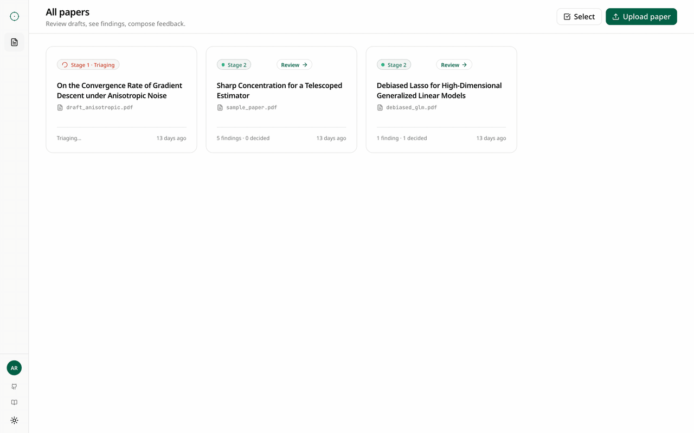

<p align="center">
  
</p>

<div align="center">

# Loupe

**A loupe for your proofs.**
An open-source AI reviewer for scientific papers.

[](https://loupe.morphmind.ai)

[](./LICENSE) [](https://loupe.morphmind.ai) [](https://morphmind.ai) [](#privacy-by-design)

[**What it does**](#what-loupe-does) · [**Quick start**](#quick-start) · [**Privacy**](#privacy-by-design) · [**Model providers**](#model-providers) · [**Architecture**](#architecture)

</div>

> The hosted demo at **[loupe.morphmind.ai](https://loupe.morphmind.ai)** runs the latest release. To join the free-trial waitlist, sign up at **[agentlab.morphmind.ai](https://agentlab.morphmind.ai)** and we'll notify you once Loupe is launched. Everything you see there you can also self-host with the steps below.

---

## What Loupe does

Loupe is an AI review tool for scientific paper authors, reviewers, editors. Upload a paper; Loupe surfaces the handful of proof steps that deserve a second look — arithmetic slips, flipped inequalities, unstated assumptions, wrong constants, quantifier confusion — then lets you agree, dismiss, or push back on each one before generating a draft review you can edit and send.

It's the opinionated take of a journal reviewer's first pass, compressed from hours into minutes.

**Loupe is not** a proof solver, a plagiarism checker, or a replacement for human judgment. It's a magnifier — you decide what matters.

---

## Why not just paste the paper into ChatGPT?

A 2026 INFORMS study of 6,957 submissions and 10,389 reviews at *Organization Science* — the first journal to report it — found AI-assisted reviews are "narrower" and "lower quality" than human ones, while submission volume rose 42% since the late-2022 release of ChatGPT.[^1] More research, less rigorous review.

Loupe is built for the other direction. **An AI agent designed by researchers, for researchers** — not a chat window with a paper attached. A 50-page manuscript dropped into a generic chatbot returns one long blob: no citations to lines or pages, no record of what was actually checked, no way to push back on a single claim, and a token bill that grows with every follow-up. Loupe runs a ~$0.03 triage in about fifteen seconds first; the deep dive is opt-in and segment-by-segment, with severity-tagged findings each pinned to a bounding box on the PDF. You agree, dismiss, or investigate each one — quick actions like *re-derive*, *find a counterexample*, *check the citation* open a thread on that specific finding, not the whole paper. Every run logs token usage and dollar cost per segment, and the local-LLM path keeps the manuscript on your laptop end-to-end.

<p align="center">
  
</p>

Loupe is opinionated about how AI should help with peer review: progressively, structured, cited, and cheap enough to run on every paper rather than only the ones you already suspect — which is the new experience of human-AI coworking.

[^1]: Gartenberg, C., Hasan, S., Murray, A., & Pierce, L. (2026). *More Versus Better: Artificial Intelligence, Incentives, and the Emerging Crisis in Peer Review.* Organization Science, Articles in Advance. [doi:10.1287/orsc.2026.ed.v37.n3](https://doi.org/10.1287/orsc.2026.ed.v37.n3). We thank [Prof. De Liu](https://carlsonschool.umn.edu/faculty/de-liu) (Carlson School of Management, University of Minnesota) who pointed this reference to us.

---

## Key features

- **Two-stage review** — a one-minute triage produces an H/M/L verdict; a deep dive then scores the paper across six dimensions (proof, literature, clarity, numerical, relevance, novelty).
- **Visual localization** — every finding is pinned to a bounding box on the PDF, verified by a vision pass. Parser-mismatched findings are dropped, never faked.
- **Issue types grounded in the domain** — arithmetic, logic, unstated assumption, wrong constant, quantifier scope, citation required, definition mismatch, missing step.
- **Investigate, don't trust blindly** — any finding opens into a back-and-forth thread. Quick actions: re-derive, find a counterexample, check the citation, propose a fix.
- **Severity + confidence on every finding** — triage in seconds; sort by severity, page, or confidence.
- **Draft review generator** — produces structured markdown grouped by your verdicts. Edit live; copy or download as `.md` / `.pdf`.
- **Model-agnostic** — OpenAI, Anthropic, DeepSeek, Moonshot, MiniMax — or your own local Ollama / vLLM / LM Studio server. Pick from the settings panel.
- **Local-first by default** — your laptop is enough. Bring your own key, or skip the cloud entirely with the local-LLM path.

---

## Built on MorphMind

Loupe is a specialized agent derived from **[MorphMind](https://morphmind.ai)** — a platform that spawns production-grade AI agents for any deep domain (peer review, literature research, AI for drug discovery, biomedical study, scientific writing, data science, chip design, contract generation, website development, financial trading, business management, VC scouting, …).

---

## Privacy by design

Peer review hands you the most sensitive document an academic produces — an unpublished manuscript under embargo. Loupe is built so you can do the work without that document ever leaving your hardware.

- **Run end-to-end on a local LLM.** Point Loupe at [Ollama](https://ollama.com), [vLLM](https://github.com/vllm-project/vllm), [LM Studio](https://lmstudio.ai), `llama.cpp`'s server, or any OpenAI-compatible endpoint. Configure two env vars and the model selector picks it up automatically.
- **Self-host the PDF parser.** [MinerU](https://github.com/opendatalab/MinerU) is open-source. Run it on your own GPU and Loupe will use it.
- **No telemetry.** Self-hosted Loupe does not phone home. The only outbound HTTP is to the LLM and parser endpoints **you** configure.
- **Hosted is opt-in.** [`loupe.morphmind.ai`](https://loupe.morphmind.ai) is a separate convenience deployment by MorphMind for users who don't want to run infra. Self-hosters never touch it.

The settings panel labels each provider with its privacy posture so you can see at a glance whether your paper text leaves the machine.

## Model providers

| Group | Models | Privacy posture | Key |
|---|---|---|---|
| **OpenAI** | GPT-4.1 | Sends paper text to OpenAI | `OPENAI_API_KEY` |
| **Anthropic** | Claude Opus 4.7 (highest quality), Claude Sonnet 4.6 (default) | Sends paper text to Anthropic | `ANTHROPIC_API_KEY` |
| **Other LLM Providers** | DeepSeek V3, Moonshot Kimi K2.5, MiniMax M2.7 | Sends paper text to the chosen provider | `DEEPSEEK_API_KEY` / `MOONSHOT_API_KEY` / `MINIMAX_API_KEY` |
| **Ollama (local)** | any model in your `OLLAMA_MODELS` list | **Your paper never leaves your machine** | `OLLAMA_BASE_URL`, `OLLAMA_MODELS` |
| **Custom OpenAI-compatible (local)** | any model your endpoint serves | Goes only to the endpoint you configured | `LOCAL_OPENAI_BASE_URL`, `LOCAL_OPENAI_API_KEY`, `LOCAL_OPENAI_MODELS` |

Configure as many as you like — Loupe queries `GET /v1/providers` at runtime and the settings panel shows only the ones that are reachable. Visual localization works with any vision-capable cloud model (Claude family, GPT-4.1 / GPT-4o, or any OpenAI-compatible local endpoint serving a vision model — set via `VISION_MODEL`); local-only mode keeps text analysis private and skips visual verification when the configured vision model is unreachable.

---

## Quick start

### Frontend-only (mock mode — no backend, no keys)

```bash
cd frontend
npm install
npm run dev
```

Open <http://localhost:3009>. The frontend ships with a 5-bug fixture; you can walk the full upload → analyze → review flow without any backend. Set `NEXT_PUBLIC_USE_MOCK=0` in `frontend/.env.local` later to switch to the real backend.

### Full local stack (backend + frontend + your choice of LLM)

```bash
# 1. Backend
cd backend
python -m venv .venv && source .venv/bin/activate
pip install -r requirements.txt
cp ../.env.example ../.env
# Edit ../.env — fill in at least ONE of the provider blocks below.
uvicorn app.main:app --reload --port 8009

# 2. Frontend (separate terminal)
cd frontend
npm install
npm run dev   # http://localhost:3009
```

#### Cloud setup (one example)

```bash
# in .env
ANTHROPIC_API_KEY=sk-ant-...
DEFAULT_MODEL=claude-sonnet-4-6
```

#### Local setup with Ollama (private path)

```bash
# in .env
OLLAMA_BASE_URL=http://localhost:11434
OLLAMA_MODELS=qwen2.5:32b,llama3.1:70b
DEFAULT_MODEL=ollama:qwen2.5:32b
```

```bash
# host
ollama pull qwen2.5:32b
ollama serve   # runs on :11434 by default
```

That's it — Loupe will route every analysis call to Ollama. Your paper text never leaves localhost.

---

## Architecture

```
                 ┌──────────────────────┐
                 │  Next.js 14 frontend │
                 │   /papers · workspace │
                 └──────────┬───────────┘
                       /api │  mock-able via MSW
                            ▼
                 ┌──────────────────────┐
                 │    FastAPI backend    │
                 │   JSON-file storage   │
                 └──────────┬───────────┘
        ┌───────────────────┼──────────────────────┐
        ▼                   ▼                      ▼
 ┌─────────────┐   ┌──────────────────┐   ┌──────────────────┐
 │   MinerU    │   │  LLM providers   │   │  Vision model    │
 │  (parse →   │   │  Anthropic /     │   │ (localize bbox + │
 │   markdown) │   │  OpenAI / China /│   │  verify evidence)│
 │  self-host  │   │  Ollama / local  │   │   cloud vision   │
 │  optional   │   │  OpenAI-compat   │   │   model required │
 └─────────────┘   └──────────────────┘   └──────────────────┘
```

Everything is **raw HTTP** — no SDK dependencies for LLM providers, easy to fork and swap. Storage is flat JSON files in `data/` for clone-and-inspect friendliness.

## Project structure

```
loupe/
├── backend/
│   └── app/
│       ├── main.py               # FastAPI app, singletons
│       ├── config.py             # env-driven settings
│       ├── models.py             # Pydantic shapes (mirror frontend/lib/types.ts)
│       ├── routes/               # /papers, findings, review, providers, folders
│       ├── services/             # orchestrator, llm_client, storage, mineru_client
│       └── pipeline/             # 3 steps: parse → extract_proofs → verify_proofs
│           └── prompts/          # composable prompt builders
├── frontend/
│   ├── app/                      # Next.js App Router
│   │   └── papers/[id]/          # workspace (PDF + findings panel)
│   ├── components/
│   │   ├── brand/                # Loupe mark + lockup
│   │   ├── shell/                # sidebar, theme toggle, MSW boot
│   │   ├── papers/               # list, card, upload dialog
│   │   ├── workspace/            # PDF viewer, finding card, progress strip
│   │   ├── review/               # report card + draft modal
│   │   └── ui/                   # shadcn primitives
│   ├── lib/
│   │   ├── api.ts                # typed fetch wrappers (the API contract)
│   │   ├── types.ts              # mirrors backend models
│   │   └── hooks/                # TanStack Query hooks
│   ├── mocks/                    # MSW handlers + fixtures (5-planted-bug fixture)
│   └── public/
│       ├── brand/                # Loupe mark, lockup, decor, social
│       └── icons/issue-types/    # 9 finding glyphs
├── LICENSE                       # Apache 2.0
├── NOTICE                        # required Apache attribution
└── README.md
```

## API contract

Fully documented in `frontend/lib/api.ts`. Core surface:

```
GET    /v1/papers                           list papers
POST   /v1/papers                           upload (multipart) + kick pipeline
GET    /v1/papers/{id}                      full paper + findings + exchanges
DELETE /v1/papers/{id}
GET    /v1/papers/{id}/status               poll pipeline state
GET    /v1/papers/{id}/events               SSE stream (optional)
GET    /v1/papers/{id}/pdf                  binary PDF

POST   /v1/papers/{id}/findings/{fid}/decide        agree | dismiss
POST   /v1/papers/{id}/findings/{fid}/investigate   back-and-forth
POST   /v1/papers/{id}/findings/{fid}/localize      on-demand vision-verify

POST   /v1/papers/{id}/review/generate      → {draft_id, markdown}
PATCH  /v1/papers/{id}/review/{draft_id}    save editor changes
GET    /v1/papers/{id}/review/{draft_id}/export?format=pdf|md

GET    /v1/providers                        configured LLM providers + reachability
```

Error envelope is uniform: `{ error: { code, message, detail? } }`.

## Design system

Loupe is a sibling product in the MorphMind design family:

- **Primary:** emerald `#065F46` (`oklch(0.432 0.095 166.913)`)
- **Type:** Noto Sans (UI + wordmark) · Geist Mono (code + formulae)
- **Mark:** lens + reticle (precision, optical). Distinct from sister projects' marks.
- **Tokens:** live in `frontend/app/globals.css` as CSS variables.

## Hosted vs self-hosted

| | Hosted (loupe.morphmind.ai) | Self-hosted |
|---|---|---|
| Setup | None — sign in with an invitation code | Clone, install, fill in `.env` |
| LLM key | MorphMind's | Yours |
| PDF parsing | MorphMind's MinerU | Yours (or skip) |
| Privacy | Paper text reaches MorphMind + the chosen LLM | Stays on your hardware (Ollama path) |
| Cost | Per-paper fee — see pricing page | Provider cost only |
| Updates | Latest release, automatically | When you `git pull` |

## Contributing

Loupe is in active development. The most useful contributions right now:

1. **Try it on a real paper** and open an issue with a screenshot + the paper's arXiv link. The hardest thing to improve is the verifier prompt; real cases drive that.
2. **File false-positive and false-negative examples** with the quoted evidence — we use these to tune `verify_proofs`.
3. **New LLM provider routes** — extend `_ROUTING` in `backend/app/services/llm_client.py` and the matching entry in `backend/app/routes/providers.py`.
4. **Frontend polish** — empty states, a11y, keyboard shortcuts, dark-mode audit.

Loupe is licensed under Apache 2.0; by submitting a PR you agree your contribution is licensed under the same terms (no separate CLA required — the Apache 2.0 patent grant in §3 of `LICENSE` covers your contribution automatically). Please open an issue before sending a PR for anything larger than a bug fix.

## Roadmap (not promises)

- SSE streaming for the analysis view
- Token streaming on investigation replies
- Local vision model adapter (so the localize step works without a cloud key)
- Batch mode (queue up 10 papers, walk through them in sequence)
- Learned-rules personalization (what the editor flagged last time, de-duplicated this time)
- Venue templates (JASA, Biometrika, NeurIPS, ICML) for the draft review
- Docker compose one-liner

## License

Apache 2.0 — see [`LICENSE`](./LICENSE) and [`NOTICE`](./NOTICE). Copyright © 2026 AIScientists, Inc. (dba MorphMind).

---

<p align="center">
  <sub>
    Loupe is an open-source agent derived from the agent-spawning platform <a href="https://morphmind.ai"><strong>MorphMind</strong></a>.<br>
    Hosted at <a href="https://loupe.morphmind.ai">loupe.morphmind.ai</a> · Contact: Jay (jie@morphmind.ai).
  </sub>
</p>
